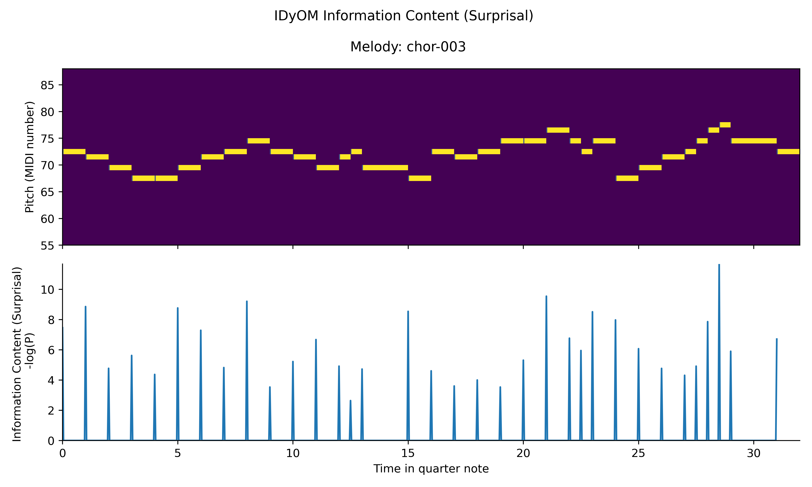
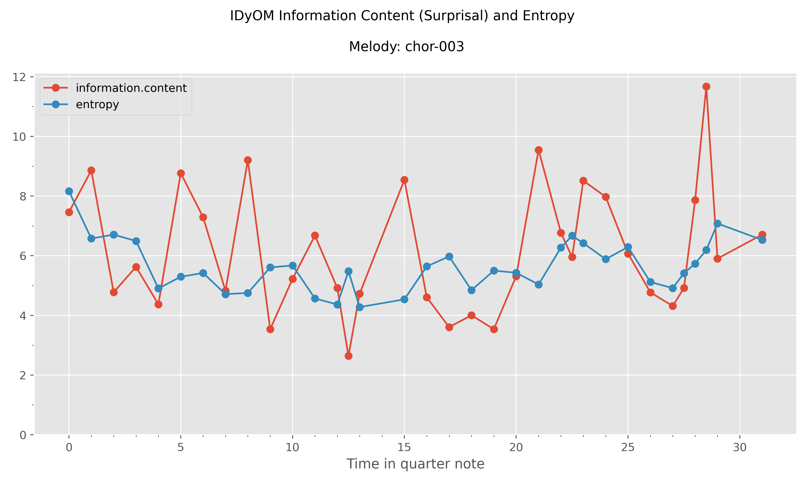

# Statement of need

Music is a complex, multi-layered signal that displays structures along a variety of dimensions - among which melodic and rhythmic sequences play a crucial role across styles and cultures [@PearceWiggins2006]. Empirical studies have consistently demonstrated that listeners have strong and well-defined musical predictions that reflect the long-range statistical regularities present in the music they have heard across their lifespan [@Margulis2005; @Morgan2019]. These statistics are learned through passive exposure to the music in everyday life [@Bigand2006; @Eerola2009; @Rohrmeier2011].

The Information Dynamics of Music (IDyOM) has been a well-established computational model for melodic expectation in the music cognition community and has been empirically tested in various behavioral and neural 
studies [@PearceWiggins2012; @Di2020; @Politimou2021]. IDyOM models listeners’ online expectations of musical events using predictions from variable-order Markov chains [@Pearce2005; @Pearce2018]. Its long-term component is pre-trained on a large musical corpus and its short-term component dynamically learns the local statistics of a melody, simulating long-term learning of musical statistics and short-term learning of musical patterns respectively.

For each note in a melody, IDyOM outputs a probability derived by merging the long-term and short-term distributions. From this distribution, two information-theoretic measures characterize the predictions of the model. Surprisal (or Information Content) represents the expectedness (i.e. the note predicted matched the note heard) of each note given the long term (corpus statistics) and short term (melody statistics) context. Entropy corresponds to the degree of uncertainty of the prediction being made. Entropy and surprisal are intended to simulate listeners' dynamical updating expectations–their predictions–when listening to music.

Although the model has been firmly established as a powerful tool to model listener’s experience, the Common Lisp ecosystem, in which the IDyOM model is built in, entails a significant entry barrier for researchers who intend to use the model. On the one hand, Common Lisp is a fairly niche programming language for data analysis and gathers a rather small community of users in music psychology and music cognition in this day and age. On the other hand, to use the IDyOM model, it is assumed that users, who are often new to the Lisp language, are familiar with Emacs and SLIME, which themselves can take up a lot of time and energy to learn. Therefore, obtaining the IDyOM outputs can be discouraging and time-consuming.

To help researchers further bring insights in the music cognition domain, we introduce the `py2lispIDyOM` package which aims to fill this gap by providing an easy-to-use Python-based interface to run IDyOM model and harness the extensive support libraries in Python to conduct IDyOM-based analysis. With `py2lispIDyOM`, we circumvent the challenge of writing Lisp codes and hide the complexities of the necessary interactions with Lisp in Emacs from the users.

# Summary

`py2lispIDyOM` is an open-source Python package that serves as a unifying Python interface that simplifies and
streamlines the research workflow for running the IDyOM model and analyzing output data. It is broadly aimed at researchers conducting IDyOM-based analysis in Python. This package makes it easier to do the following two tasks: (i) configuring and running the IDyOM model, and (ii) processing and analyzing the IDyOM output data.

Users can now configure the IDyOM experiments in Python using the `IDyOMExperiment` object and, based on
it, `py2lispIDyOM` will generate a Lisp script to run the IDyOM. To encourage an organized workflow and to improve the reproducibility of data, all data related to an experiment will be logged in a structured folder, which can be shared with other researchers to verify and replicate the experiment results. The logged data includes, but is not limited to, the datasets used for the experiment, the generated Lisp script, and the IDyOM output file (in `.dat` format).

For the processing and analysis of the IDyOM outputs, we implemented three functionalities as modules: `extract`, `export`, and `visualization`. Each module contains methods that we frequently used in our previous research projects. In the current version, we provided several common types of figures as shown below in the `visualization` module. For example, for each test melody, we can show the piano roll plots for pitch prediction distribution (\autoref{fig:Fig1}, upper panel) and visually compare it to the ground truth (\autoref{fig:Fig1}, lower panel) for this particular melody. The surprisal values can be visualized along with the corresponding piano roll, as illustrated in \autoref{fig:Fig2}. The model's output for distinct viewpoints can be visualized in \autoref{fig:Fig3} (upper panel: pitch only, middle panel: onset only, lower panel: pitch and onset combined).  \autoref{fig:Fig4} displays the predicted surprisal and entropy values (based on the pitch and onset combined model). All plotting functions in this package follow the same syntax, and therefore users can easily customize their own figures by using the provided examples. The package includes tutorials in the form of Jupyter notebooks on the GitHub repository. These tutorials present examples using the aforementioned functionalities.

The package has been used in several ongoing research projects at the Max Planck - NYU Center for Language, Music and Emotion. Therefore, we hope this package can bring similar values to other research groups working on IDyOM-based analysis.

# Figures
 
{ width=85% }

{ width=85% }

{ width=85% }

{ width=85% }

# References
