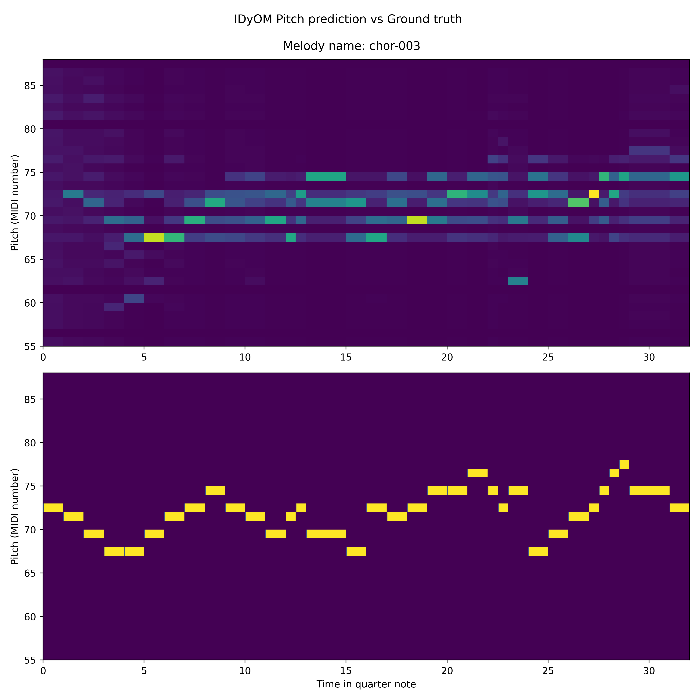
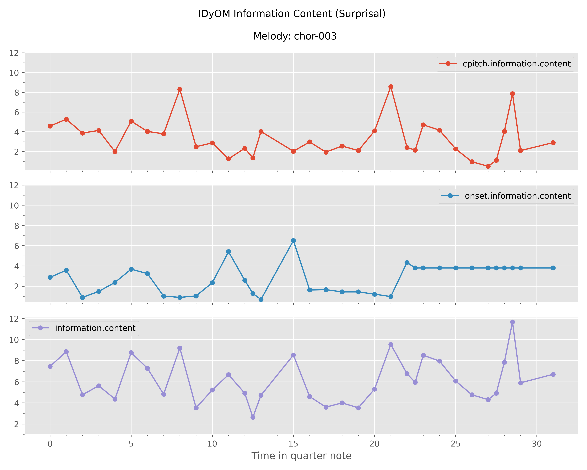

# Statement of need

Music is a complex, multi-layered signal that displays structures along a variety of dimensions - among which melodic
and rhythmic sequences play a crucial role across styles and cultures [@PearceWiggins2006]. Empirical studies have
consistently demonstrated that listeners have strong and well-defined musical predictions that reflect the long-range
statistical regularities present in the music they have heard across their lifespan [@Margulis2005; @Morgan2019]. These
statistics are learned through passive exposure to the music in everyday life [@Bigand2006; @Eerola2009; @Rohrmeier2011].

The Information Dynamics of Music (IDyOM) has been a well-established computational model for melodic expectation in the
music cognition community and has been empirically tested in various studies [@PearceWiggins2012]. IDyOM models
listeners’ online expectations of musical events using predictions from variable-order Markov chains [@Pearce2005; @Pearce2018]. Its long-term component is trained on a large musical corpus and its short-term
component dynamically learns the local statistics of a melody, simulating long-term learning of musical statistics and
short-term learning of musical patterns respectively.

For each note in a melody, IDyOM outputs a probability derived by merging the long-term and short-term distributions.
From this distribution, two information-theoretic measures characterize the predictions of the model. Surprisal (or
Information Content) represents the expectedness (i.e. the note predicted matched the note heard) of each note given the
long term (corpus statistics) and short term (melody statistics) context. Entropy corresponds to the degree of
uncertainty of the prediction being made. Entropy and surprisal are intended to simulate listeners' dynamical updating
expectations–their predictions–when listening to music.

Although the model has been firmly established as a powerful tool to model listener’s experience, the Common Lisp
ecosystem, in which the IDyOM model is built in, entails a significant entry barrier for researchers who intend to use
the model. On the one hand, Common Lisp is a fairly niche programming language for data analysis and gathers a rather
small community of users in the music psychology and music cognition. On the other hand, to use the IDyOM model, it is
assumed that users, who are often new to the Lisp language, are familiar with Emacs and SLIME, which themselves can take
up a lot of time and energy to learn. Therefore, obtaining the IDyOM outputs can be discouraging and time-consuming.

As a result, to help researchers further bring insights in the music cognition domain, we introduce the `py2lispIDyOM`
package which aims to fill this gap by providing an easy-to-use Python-based interface to run IDyOM model and harness
the extensive support libraries in Python to conduct IDyOM-based analysis. With `py2lispIDyOM`, we reduce the challenge
of writing Lisp codes and hide the complexities of the necessary interactions with Lisp in Emacs from the users.

# Summary

`py2lispIDyOM` serves as a unifying Python interface that simplifies and streamlines the research workflow for running
the IDyOM model and analyzing output data. It is broadly aimed at researchers conducting IDyOM-based analysis. This
package makes it easier to do the following two tasks: (i) configuring and running the IDyOM model, and (ii)
processing and analyzing the IDyOM output data.

Users can now configure the IDyOM experiments in Python using the `IDyOMExperiment` object and, based on
it, `py2lispIDyOM` will generate a Lisp script to run the IDyOM. To encourage an organized workflow and to improve the
reproducibility of data, `py2lispIDyOM` will log all data related to an experiment in a structured folder, which can be
shared with other researchers to verify and replicate the experiment results. The logged data includes, but not limited
to, the datasets used for the experiment, the generated Lisp script, and the IDyOM output file (in `.dat` format).

For the processing and analysis of the IDyOM outputs, we implemented three functionalities as modules: `extract`
, `export`, and `visualization`. Each module contains methods that we frequently used in our previous research projects.
For example, in the `visualization` module, we included several types of figures as shown below. The package includes
tutorials in the form of Jupyter notebooks on the github repository. These tutorials demonstrate the usage of the
aforementioned functionalities.

The package has been used in several ongoing research projects at the Max Planck - NYU Center for Language, Music and
Emotion. Therefore, we hope this package can bring similar values to other research groups working on IDyOM-based
analysis.

# References
